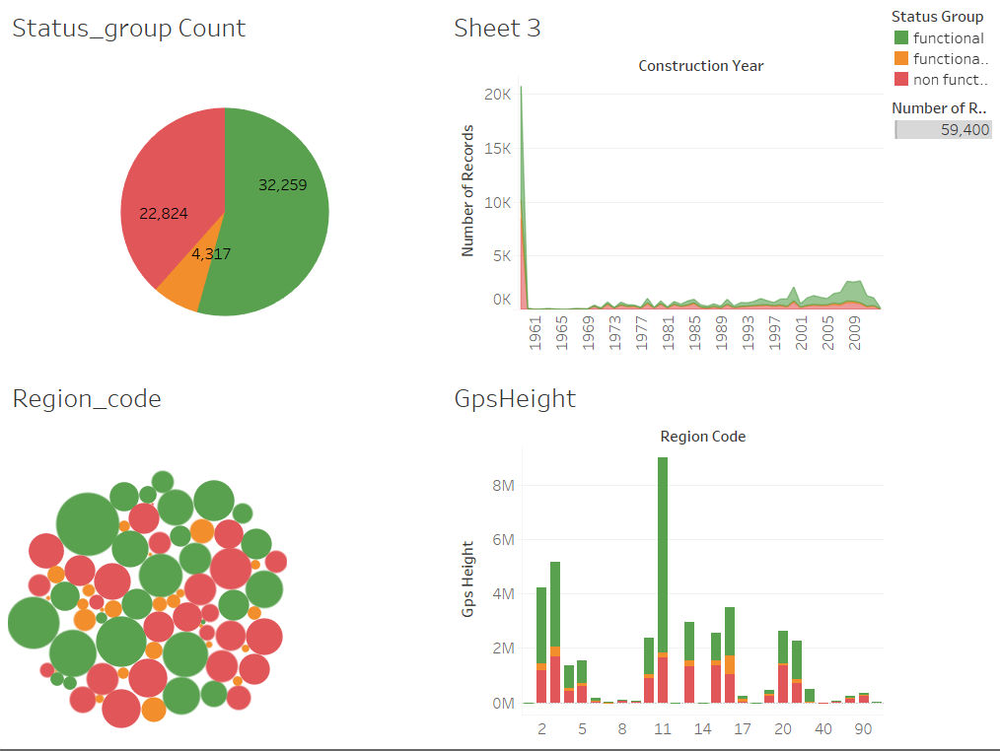

# Springboard-capstone1
Topic: Pump it Up: Data Mining the Water Table.
Task:  Predict which water pumps are faulty? (predict which pumps are functional, which need some repairs, and which don't work at all?)

Using data from Taarifa and the Tanzanian Ministry of Water,  Predict one of these three classes based on a number of variables about what kind of pump is operating, when it was installed, and how it is managed. A smart understanding of which waterpoints will fail can improve maintenance operations and ensure that clean, potable water is available to communities across Tanzania.

Goal is to predict the operating condition of a waterpoint for each record in the dataset. 

