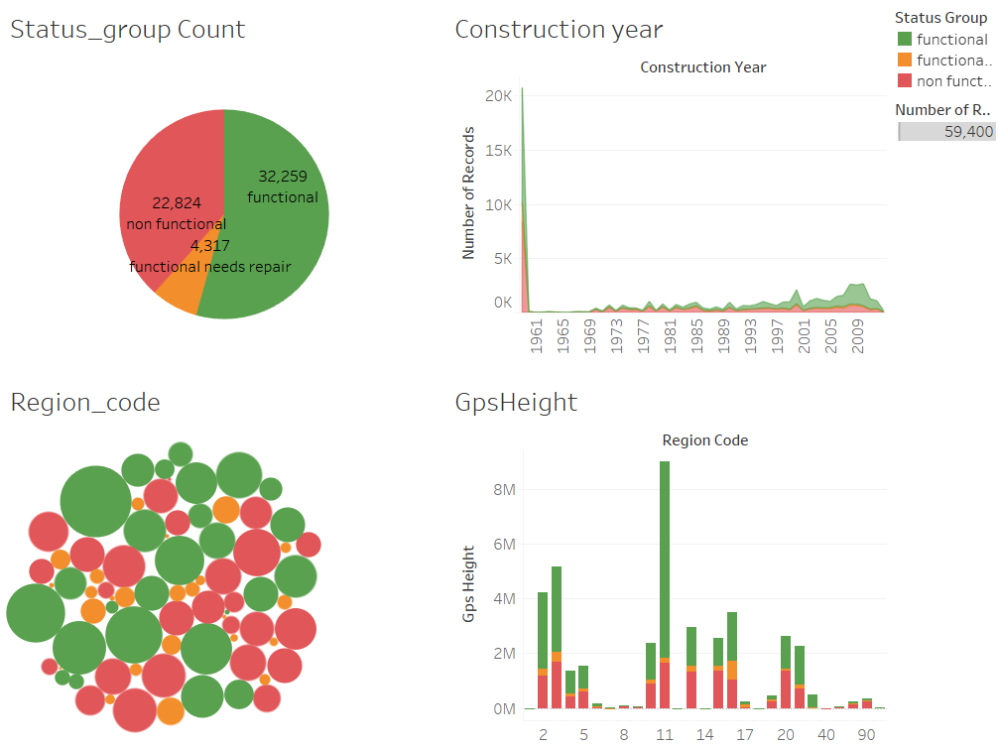

# Springboard-capstone1
## Problem Description
Predict which water pumps are faulty? (predict which pumps are functional, which need some repairs, and which don't work at all?)Using data from Taarifa and the Tanzanian Ministry of Water,  predict the operating condition of a waterpoint for each record in the dataset.

 A training dataset with information of nearly sixty thousand water points across Tanzania is provided and it is expected to build a model which will be able to predict which water points are functional, nonfunctional and functional but need repair on a test dataset. A model like this will help the Tanzanian government to tell which water point is likely to need repair and which are nonfunctional. This can help improving operational efficiency of water point maintenance.
 

